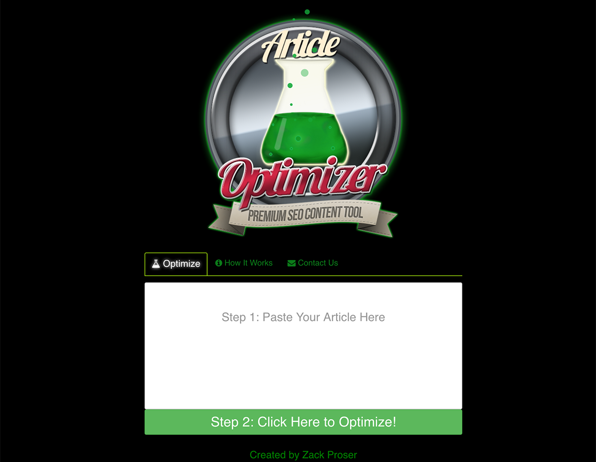

# [Article Optimizer](https://www.article-optimize.com)

## Overview 

This application allows users to submit text articles on any subject and have their content analyzed. This application is live and free to use at [www.article-optimize.com](https://www.article-optimize.com). For a more in-depth write-up of this application, read [my technical blog post about it here](https://www.zackproser.com/blog/article/I-Open-Sourced-My-Content-Analysis-Tool).
 
 The resulting report will make suggestions on keyword, phrase and sentiment optimizations that the author can make to improve the legibility and hopefully the overall rankings of their work. The report will also search for high quality on-topic images that are 
copyright-free, allowing the author to quickly drop them into their content to improve its media richness.

This project was open-sourced in order to: 
 * give back to the open-source community
 * provide a demonstration of a non-trivial Symfony web app
 * demonstrate a use case for IBM's Watson linguistic processing API

This application, its assets and all associated documentation was created by Zack Proser: 

* [Portfolio site](https://www.zackproser.com)
* [Email](mailto:zackproser@gmail.com) 
* [Github](https://www.github.com/zackproser)

## Application at a Glance

### Content Analysis
The Article Optimizer is a search engine optimization tool for content authors. It provides a useful free service in providing authors with detailed analysis of their unique content, leveraging IBM's Watson linguistic analysis functionality, along with suggestions for improving long term search rankings. 

### Persistent Reports
Article reports are written to the server as soon as they are complete, so that they can be looked up in perpetuity and served quickly, since they are static HTML pages. 

### Targeted Content Marketing
In exchange, the application can gather user email addresses and subscribe them to a mailchimp list for longterm engagement and marketing of related products, if the user provides their consent to receive such communications.

### Display Advertising 
In addition, the application can be configured to display two separate advertising modules, each featuring 2 separate advertisements, integrated into the user's content report for the purposes of affiliate marketing or direct marketing of the application's owners' products or services.

### Social Media Sharing
To maximize social sharing of reports, each report gets its own programmatically generated Bitly link so that sharing and traffic can be monitored at a granular report level. Users can also share their report (and thereby the application itself) via Twitter, Pinterest, Facebook or by emailing the report directly to a friend or colleague, all with one click.

### Analytics
The application allows you to drop-in the Google Analytics property id you would like associated, allowing you to track usage patterns and traffic across all pages and reports with no additional effort or custom development.

### Services Integrated

The Article Optimizer leverages 

* [Alchemy API - now part of IBM's Watson cloud](https://www.ibm.com/watson/developercloud/alchemy-language.html)
* [Mailchimp](https://mailchimp.com/)
* [Flickr](https://www.flickr.com/)
* [Google Analytics](https://google.com/analytics)
* [Bitly](https://bitly.com)
* [Pinterest](https://pinterest.com)
* [Facebook](https://www.facebook.com)
* [Twitter](https://www.twitter.com)

### Tech Stack 
This application was built using: 

* [Symfony 3.1](https://symfony.com) 
* [PHP 7](https://php.net) 
* [Bootstrap](https://getbootstrap.com) 
* [jQuery](https://jquery.com) 
* [nginx](https://nginx.com)
* [Linode VPS](https://linode.com)
